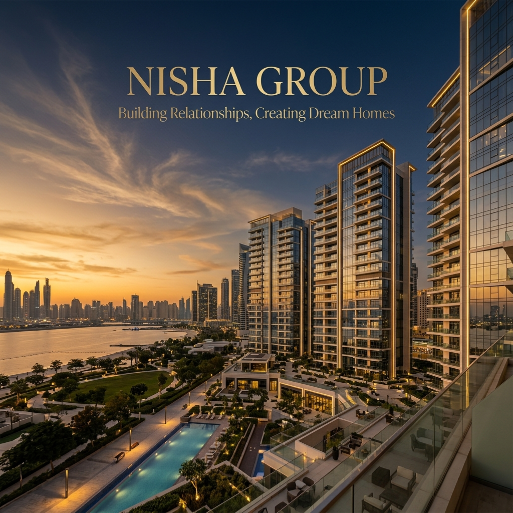

<p align="center">
  
</p>

<p align="center">
  
  
  
  
</p>

<h1 align="center">🏠 Nisha Group — Official Website</h1>

<p align="center">
  <strong><em>Building Relationships, Creating Dream Homes</em></strong><br/>
  Premium real estate developer in Aurangabad, Maharashtra since 2006.
</p>

<p align="center">
  <a href="#overview">Overview</a> •
  <a href="#project-structure">Structure</a> •
  <a href="#pages">Pages</a> •
  <a href="#features">Features</a> •
  <a href="#projects-showcased">Projects</a> •
  <a href="#getting-started">Getting Started</a>
</p>

---

## Overview

**Nisha Group** is a leading real estate developer in Aurangabad, crafting timeless residential and commercial spaces since 2006. The website is a fully static, multi-page HTML/CSS/JS site with a premium dark-gold design system featuring smooth animations, hero sliders, enquiry modals, and a fully responsive layout.

<p align="center">
  
</p>

---

## Project Structure

```
nisha group/
│
├── 📄 index.html              # Homepage
├── 📄 about.html              # About the company
├── 📄 projects.html           # All projects (ongoing, completed, upcoming)
├── 📄 project-detail.html     # Dynamic project detail page
├── 📄 events.html             # Events & activities
├── 📄 blogs.html              # Blog articles
├── 📄 media.html              # Media gallery
├── 📄 careers.html            # Job openings
├── 📄 contact.html            # Contact form & map
├── 📄 sitemap-page.html       # HTML sitemap
├── 📄 disclaimer.html         # Legal disclaimer
├── 📄 privacy.html            # Privacy Policy
├── 📄 terms.html              # Terms & Conditions
│
├── 📁 css/
│   └── style.css              # Main stylesheet (design system, 44KB)
│
├── 📁 js/
│   └── main.js                # Core JavaScript (8KB)
│
├── 📁 assets/
│   └── images/                # Local image assets
│
├── 🖼️ logo.png                # Brand logo & favicon
└── 📑 Nisha Profile.pdf       # Company profile brochure
```

---

## Pages

| Page | File | Description |
|------|------|-------------|
| 🏠 **Home** | `index.html` | Hero slider, about snapshot, projects, testimonials, contact form |
| 🏢 **About** | `about.html` | Company history, team, mission & values |
| 🏗️ **Projects** | `projects.html` | Filterable grid — Ongoing / Completed / Upcoming |
| 🔍 **Project Detail** | `project-detail.html` | Dynamic page via `?project=` URL param |
| 🎉 **Events** | `events.html` | Upcoming & past events |
| 📰 **Blogs** | `blogs.html` | Real estate news & insights |
| 📸 **Media** | `media.html` | Photo & video gallery |
| 💼 **Careers** | `careers.html` | Job listings & application |
| 📞 **Contact** | `contact.html` | Inquiry form with map |
| 🗺️ **Sitemap** | `sitemap-page.html` | Full HTML sitemap |
| ⚖️ **Legal** | `disclaimer / privacy / terms` | Compliance & legal pages |

---

## Technologies Used

<p align="center">
  
  
  
  
  
</p>

| Technology | Purpose |
|------------|---------|
| **HTML5** | Semantic page structure |
| **Vanilla CSS** | Custom design system with CSS variables |
| **Vanilla JavaScript** | Interactivity, animations, sliders |
| **CSS Custom Properties** | Design tokens — colors, spacing, typography |
| **SVG Icons** | Inline icons (zero dependencies) |
| **Unsplash** | High-quality imagery |

---

## Features

### 🎨 Design & Visual
<p align="center">
  
</p>

- **Gold + Dark theme** with CSS custom properties
- Fully **responsive** — mobile-first across all screen sizes
- **Preloader animation** on page load
- Hero sections with **gradient overlays**

### ⚡ Interactive Elements

| Feature | Description |
|---------|-------------|
| 🖼️ **Hero Slider** | Auto-advancing image carousel with dot navigation |
| 📊 **Animated Counters** | Scroll-triggered number counters (Years, Customers, Projects) |
| 🌀 **Scroll Animations** | Fade-up, fade-left, fade-right on content reveal |
| 🍔 **Hamburger Menu** | Mobile nav with overlay |
| 💬 **Enquire Modal** | "Schedule a Visit" popup form |
| 🟢 **WhatsApp Float** | Floating WhatsApp CTA button |
| ⬆️ **Back to Top** | Smooth scroll back-to-top button |
| 📌 **Sticky Header** | Shrinks on scroll for clean UX |

---

## Projects Showcased

### 🔄 Ongoing Projects

<p align="center">
  
  &nbsp;
  
  &nbsp;
  
</p>
<p align="center">
  <sub>Jai's Ekdant &nbsp;&nbsp;&nbsp;&nbsp;&nbsp;&nbsp;&nbsp;&nbsp;&nbsp;&nbsp;&nbsp;&nbsp;&nbsp;&nbsp;&nbsp;&nbsp;&nbsp;&nbsp; Jai Nilaya &nbsp;&nbsp;&nbsp;&nbsp;&nbsp;&nbsp;&nbsp;&nbsp;&nbsp;&nbsp;&nbsp;&nbsp;&nbsp;&nbsp;&nbsp;&nbsp;&nbsp;&nbsp; Jai's Gokuldham</sub>
</p>

| Project | Location | Type | Area |
|---------|----------|------|------|
| 🏢 **Jai's Ekdant** | Osmanpura, Aurangabad | Commercial + Residential | 50,000 Sq. Ft. |
| 🏘️ **Jai Nilaya** | Shahnoorwadi, Aurangabad | Residential | 1,00,000 Sq. Ft. |
| 🏠 **Jai's Gokuldham** | Near Airport, Aurangabad | Residential | 1,00,000 Sq. Ft. |
| 🏬 **Nisha-Bafna Plaza** | Aurangabad | Commercial | — |
| 🏗️ **Noorjahan** | Aurangabad | Residential | — |

> ✅ All projects are **MahaRERA Compliant**

---

## Why Nisha Group

<p align="center">
  
</p>

| ✅ Value | Description |
|----------|-------------|
| 🏗️ **Quality Construction** | Finest materials & superior construction practices |
| 🤝 **Transparency** | No hidden costs — clear pricing & timelines |
| 🛡️ **Ethical Business** | Highest integrity in every transaction |
| 📋 **MahaRERA Compliant** | All projects registered under MahaRERA |
| 👥 **1500+ Families Served** | Trusted by over 1500 happy homeowners |
| 🏆 **20+ Year Legacy** | Consistent delivery since 2006 |

---

## Contact Information

<p align="center">
  
</p>

| 📍 Detail | Info |
|-----------|------|
| **Address** | Jalna Road, Aurangabad, Maharashtra, India |
| **Phone** | [+91-9876543210](tel:+919876543210) |
| **Email** | [info@nishagroup.in](mailto:info@nishagroup.in) |
| **Office Hours** | Mon – Sat: 10:00 AM – 7:00 PM |
| **WhatsApp** | [Chat Now](https://wa.me/919876543210?text=Hi,%20I%20am%20interested%20in%20Nisha%20Group%20projects.) |

📱 **Social:** Facebook &nbsp;|&nbsp; Instagram &nbsp;|&nbsp; LinkedIn

---

## Getting Started

This is a **100% static website** — no build tools, no dependencies, no server required.

### ▶️ Run Locally

```bash
# Option 1: Just open in browser
start index.html

# Option 2: VS Code Live Server
# Right-click index.html → "Open with Live Server"

# Option 3: Python HTTP server
python -m http.server 8000
# Visit → http://localhost:8000
```

### 🚀 Deploy

| Platform | Method |
|----------|--------|
| **GitHub Pages** | Push repo → Settings → Pages → Enable |
| **Netlify** | Drag & drop project folder at netlify.com |
| **Vercel** | `vercel` CLI or connect Git repo |
| **cPanel Hosting** | Upload via FTP to `public_html/` |

---

## Brand Identity

| Element | Value |
|---------|-------|
| 📅 **Founded** | 2006 |
| 💬 **Tagline** | *Building Relationships* |
| 🟡 **Primary Color** | Gold — `#c9a84c` |
| 🌑 **Background** | Dark Navy — `#1a1a2e` |
| ⬜ **Accent** | White — `#ffffff` |
| 🖼️ **Logo** | `logo.png` |
| 📑 **Brochure** | [`Nisha Profile.pdf`](./Nisha%20Profile.pdf) |

---

<p align="center">
  
</p>

<p align="center">
  © 2006–2026 <strong>Nisha Group</strong>. All Rights Reserved.<br/>
  <em>Building Relationships Since 2006 · Aurangabad, Maharashtra, India</em>
</p>
